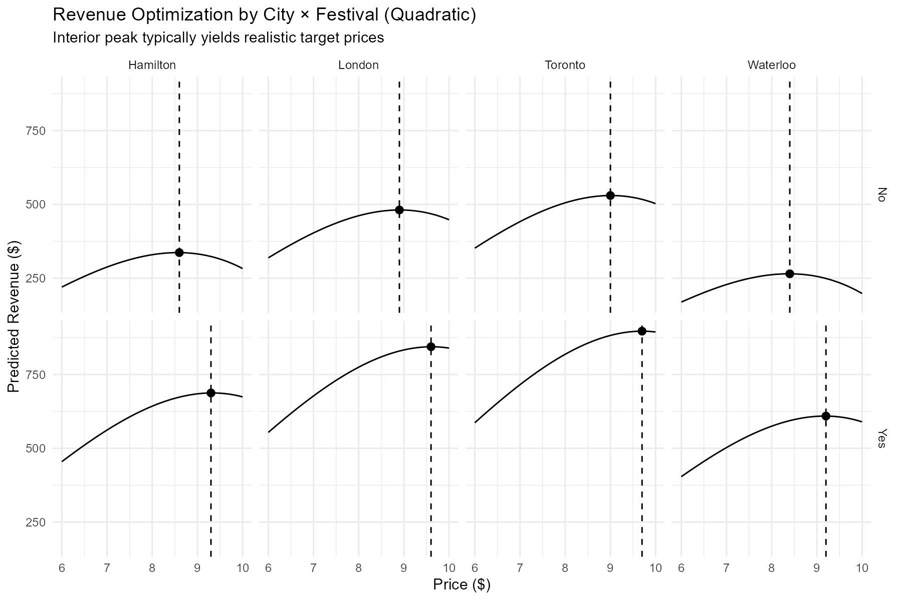
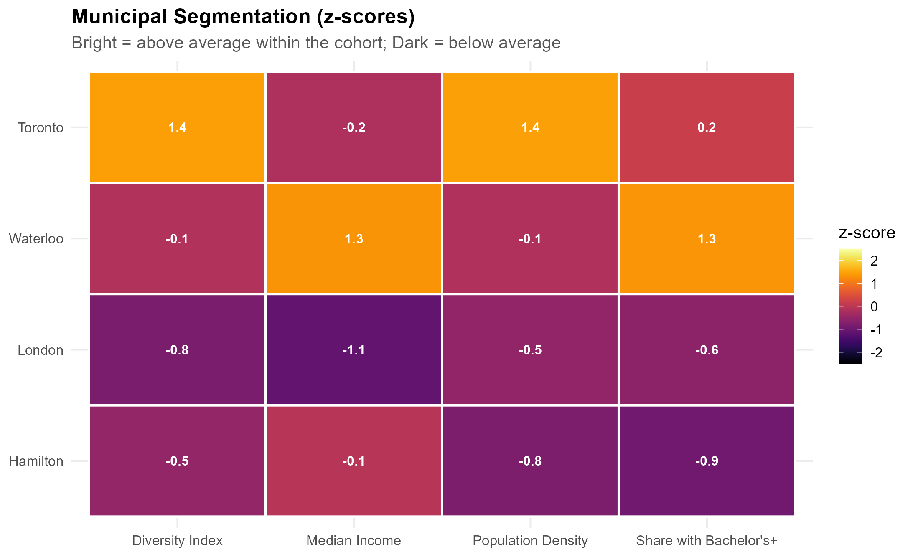
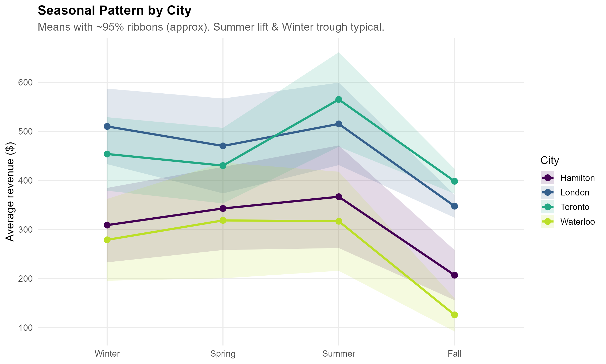

# Context-Aware Pricing and Demand Heterogeneity

An empirical Information Systems portfolio project examining how pricing outcomes vary across geographic, temporal, and event contexts in a mobile food-service setting. The analysis combines demand modeling, contextual heterogeneity, municipal characteristics, and reproducible visualization to support human decision-making.

This project is positioned as a compact observational study rather than a production pricing system. It emphasizes transparent assumptions, heterogeneous patterns, reproducibility, and the boundary between predictive evidence and causal claims.

## Research questions

- How is observed price associated with demand and expected revenue?
- How do these associations vary across cities and festival contexts?
- Which municipal characteristics distinguish local market environments?
- How do weekly and seasonal rhythms shape the decision context?
- What evidence would be required before interpreting pricing estimates causally?

## Project highlights

- Estimates observational price elasticity with log-linear demand modeling
- Compares empirical, log-linear, and quadratic revenue curves
- Examines heterogeneous pricing optima by city and festival status
- Profiles cities using normalized demographic indicators
- Visualizes daily, weekly, seasonal, and event-driven revenue patterns
- Separates reproducible analysis, source data, figures, result tables, and methodological notes

## Selected findings

The fitted pricing models suggest that the estimated revenue-maximizing price varies across operating contexts rather than following a single universal rule. Because prices were not randomly assigned, these patterns should be interpreted as decision-support evidence, not causal treatment effects.



The market analysis highlights meaningful differences in population density, income, education, and diversity across the four operating cities.



Revenue also follows clear temporal rhythms across weekdays, weekends, festivals, and seasons, illustrating how platform and managerial decisions are embedded in changing contexts.



## Repository structure

```text
.
├── analysis/
│   ├── market_temporal_analysis.qmd
│   └── pricing_optimization.R
├── data/
├── figures/
├── results/
├── docs/
│   └── methodological_notes.md
├── .gitignore
├── LICENSE
└── renv.lock
```

## Reproduce the analysis

1. Install R 4.4 or later.
2. Open the repository as the working directory.
3. Restore the recorded packages:

   ```r
   install.packages("renv")
   renv::restore()
   ```

4. Run `analysis/pricing_optimization.R`.
5. Render `analysis/market_temporal_analysis.qmd` with Quarto.

## Research design and limitations

The analysis is observational. Price may respond to anticipated demand, location, weather, festivals, or other managerial information, which creates endogeneity and selection concerns. The regressions therefore estimate conditional associations rather than causal price effects.

A stronger causal design would require randomized price variation, a defensible natural experiment, or longitudinal adjustment with clearly defined treatment timing, pre-treatment covariates, overlap diagnostics, and sensitivity analyses. These extensions connect the project to broader Information Systems questions about platform interventions and context-dependent user behavior.

See [`docs/methodological_notes.md`](docs/methodological_notes.md) for assumptions, threats to validity, and a causal extension roadmap.

## Data note

The repository contains a compact educational business-case dataset: 365 daily operating records, four city-level demographic profiles, and public geographic boundary coordinates. It contains no customer-level personal information. Results demonstrate an empirical workflow and should not be interpreted as evidence about a real operating firm or population.

## Author

Yang Ren — [GitHub](https://github.com/yooyangr)

## License

Code is released under the MIT License. The included educational case data should be used for learning and portfolio demonstration.
